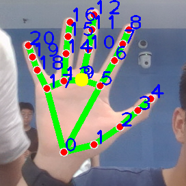

# 基于手势识别的图像浏览器
| Team member    | task                           |
| -------------- | ------------------------------ |
| 2152057 杨瑞华 | Core code logic implementation |
| 2152038 戈雨阳 | Core code logic implementation |
| 2152831 陈峥海 | documentation and PowerPoint   |

## 1. Background

### 1.1Environment
compiler: Python3.7+

package needed: opencv-python, MediaPipe, PyQt5

### 1.2How to run

on the terminal, input `python picture_viewer.py` and enter

### 1.3Idea

We consider that in some scenarios, people may not be able to directly click on devices such as mobile phones or computers for device control. For example, watching a projection screen TV in bed or watching the recipe process while cooking, and not using a mobile phone if you have oil stains on your hands. So we want to do a gesture interaction to control the device through different hand movements. Here, we are controlling the album.

 ## 2. Description

### 2.1 Overview

This project realizes the album interaction based on Gesture recognition.

User can perform different operations on the album based on different gestures.

### 2.2 Structures

The following is the core structure of the code—–

F:.
│  fingersVector.py
│  GestureRecognition.py
│  HandLandmarks.py
│  picture_viewer.py
│  picture_viewer.ui
│  picture_viewer_ui.py
│  
├─picture
│  
└─resource        

The picture folder contains some default images.

The resource folder contains some interactive images.

### 2.3 Code Logic

#### 2.3.1

We first achieved the ==localization of 21 bone points== in our fingers in `fingersVector.py`

#### 2.3.2

We ==imaged the identified joint points== and generated a mark images in `HandLandmarks.py`

HandLandmarks. py calls the mediapipe package to recognize the hand model based on machine learning and obtain the coordinates of the 21 joint point models of the hand

#### 2.3.3

Then we ==set the different gestures== based on the recognized joint point images in `GestureRecognition.py`

#### 2.3.4

Finally, we designed the interface window and called relevant functions in the window to realize our album interaction function in `picture_viewer.py`

## 3.The implemented requirements

As mentioned above, our interaction system provides several basic functions —– flipping, praising, and canceling.

The system has high scalability .

Our gestures include: 

### 3.1static gesture recognition

By calculating the vector angle and size between the coordinates of 21 joint points, calculate the extension of each finger, and then calculate different gestures.

| Gesture | core code                                                    |
| ------- | ------------------------------------------------------------ |
| OK      | fingers[0] == 0 and fingers[1] == 0 and fingers[2] == 1 and fingers[3] == 1 and fingers[4] == 1 |
| 大拇指  | fingers[0] == 1 and fingers[1] == 0 and fingers[2] == 0 and fingers[3] == 0 and fingers[4] == 0 |
| 食指    | fingers[0] == 0 and fingers[1] == 1 and fingers[2] == 0 and fingers[3] == 0 and fingers[4] == 0 |
| 中指    | fingers[0] == 0 and fingers[1] == 0 and fingers[2] == 1 and fingers[3] == 0 and fingers[4] == 0 |
| 无名指  | fingers[0] == 0 and fingers[1] == 0 and fingers[2] == 0 and fingers[3] == 1 and fingers[4] == 0 |
| 小拇指  | fingers[0] == 0 and fingers[1] == 0 and fingers[2] == 0 and fingers[3] == 0 and fingers[4] == 1 |
| 拳头    | fingers[0] == 0 and fingers[1] == 0 and fingers[2] == 0 and fingers[3] == 0 and fingers[4] == 0 |
| 手掌    | fingers[0] == 1 and fingers[1] == 1 and fingers[2] == 1 and fingers[3] == 1 and fingers[4] == 1 |
| heart   | fingers[0] == 1 and fingers[1] == 1 and fingers[2] == 0 and fingers[3] == 0 and fingers[4] == 0            and vectorSize(landmark[3], landmark[6]) < 20 and vectorAngle(landmark[4], landmark[6], landmark[8]) < 90 |
| spider  | fingers[0] == 1 and fingers[1] == 1 and fingers[2] == 0 and fingers[3] == 0 and fingers[4] == 1 |

### 3.2dynamic gesture recognition

By marking the position vectors of the hand center of gravity before and after the two frames, calculating the angle between the vector and the x-direction, as well as the length of the vector, the dynamic gesture of left and right swing is recognized.

| Gesture | core code                                                |
| ------- | -------------------------------------------------------- |
| left    | centerVector[0] < 0 and curPreSize > 180 and angle > 150 |
| right   | centerVector[0] > 0 and curPreSize > 180 and angle < 30  |

### 3.3interactive functions

Our interactive functions include the following points:

| gesture       | interactive function                |
| ------------- | ----------------------------------- |
| left          | Flip the album to the next page     |
| right         | Flip the album to the previous one  |
| heart         | Set the current photo as a favorite |
| spider/小拇指 | Cancel likes                        |

## 4. Advantages and Disadvantages

### 4.1Advantages

#### Intuitive 

Users can easily understand and master the operation. For example, using left and right sliding gestures to achieve page flipping function, using pinch gestures to achieve deletion function, etc.

#### Visual feedback

It is important to provide clear visual feedback when users perform gesture operations. Users can know that their gestures are correctly captured and interpreted through animations, indicators, or other means. This can enhance user confidence and satisfaction.

#### Sensitivity setting

 Consider providing some sensitivity setting options to meet the gesture input habits of different users. Some users may prefer quick sliding gestures, while others may prefer slow and accurate gestures.At the same time, in order to prevent the problem of dynamic Gesture recognition jumping too fast, we set a ==1.5s== interval between the two dynamic Gesture recognition

#### Multifunctional gestures

Consider incorporating more features into gesture design to provide more operational options. For example, a double click gesture can be implemented to enlarge a photo, or a rotation gesture can be used to adjust the direction of the photo. This can increase the functionality richness and user friendliness of the album application.

#### User Customization

Allowing users to customize gestures is an interesting design option. In this way, users can set gestures according to their preferences and habits, increasing personalization and user engagement.

### 4.2Disadvantages

#### Relatively simple

The functions we implement are relatively simple, with only a few basic functions.

#### Unstable recognition efficiency

Our static Gesture recognition is very accurate, but the dynamic gesture recognition is unstable. The reason is that our implementation logic is based on the change of the vector center of the front and back two frames of images.

## 5. How to improve

### 5.1 Provide external API

1. Extensibility

   By providing an external interface, I can provide other developers or applications with the ability to access my album's Gesture recognition function. This will facilitate integration and interaction, allowing my features to interact with other applications or devices, thereby expanding their application scope and potential user base.

2. Ecosystem construction: 

   By opening external interfaces, I can promote a more active and innovative developer community. Other developers can build applications, tools or services based on your Gesture recognition function, so as to enrich the ecosystem of photo album applications and bring more value and creativity.

3. Customization and Personalization:

   By improving the interface, ican provide more customization and personalization options, allowing users to adjust the interface layout, theme colors, icons, etc. according to their preferences and needs. This personalized experience can enhance user engagement and satisfaction.

### 5.2 UI optimization

1. Usability and Ease of Use

   Reasonable layout, clear identification and navigation, as well as intuitive operating procedures, can help users quickly grasp functions and operations, and improve the usability and ease of use of the application.

2. Visual appeal

   By improving the appearance and visual effects of the interface, Ican enhance the visual appeal and quality of the application. A well-designed interface can bring users a pleasant user experience, increase user stickiness and satisfaction.
